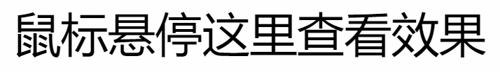
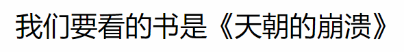

# 选择器
> 选择器的目的就是精准找到想要选中的元素

## 简单选择器
1. **ID选择器** 根据ID名选中元素
    ```HTML
    <span id="baidu">百度</span>
    ```
    ```CSS
    #baidu{
        color:bule;
    }
    ```
    > 网页效果：<span style="color:blue;">百度</span>
    ****
2. **元素选择器** 将所有同名元素选中
     ```HTML
    <h1>这是一级标题</h1>
    ```
    ```CSS
    h1{
        color:chocolate
    }
    ```
    > 网页效果：<h1 style="color:chocolate">这是一级标题</h1>
    ****
3. **类选择器** 
    ```html
    <h2 class="big">这是二级标题</h2>
    ```
    ```css
    .big{
        text-align: center;
    }
    /*也可以用h1.big{...}，即元素.类名*/
    ```
    > 网页效果：<h2 style="text-align:center;">这是二级标题</h2>
    ****
4. **通配符选择器：** 所有元素
    ```CSS
    *{
        color:red;
    }
    ```
    ****
5. **属性选择器：** 根据属性名和属性值选中元素
    ```HTML
    <a href="hppts://www.baidu.com">百度</a>
    ```
    ```CSS
    [href$="www.baidu.com"]{
        color:bule;
    }
    ```
    > 网页效果：<a href="hppts://www.baidu.com" style="color:red;text-decoration:underline;">新浪</a>
    - `[herf]` 元素包含herf属性的
    - `[herf="..."]` 元素中herf属性等于...的
    - `[class*="..."]` 元素中class属性包含...的
    - `[class^="..."]` 元素中class属性以...开头的
    - `[class$="..."]` 元素中class属性以...结尾的
    ****
6. **伪类选择器：** 选中某些元素的某种状态
    ```HTML
    <span>鼠标悬停这里查看效果</span>
    ```
    ```CSS
    span:hover{
        color:chartreuse;
    }
    ```
    > 网页鼠标长按的效果：
    > 
    - `link` 链接未访问的状态
    - `visited` 链接已访问的状态
    - `haver` 鼠标悬停的状态
    - `active` 鼠标点击时的状态
    ****
7. **伪元素选择器：** 通常用于生成并选中某个元素内部的第一个子元素或最后一个子元素。选中某些元素的一些特殊位置。
    ```HTML
    <p>我们要看的书是<span>天朝的崩溃</span></p>
    ```
    ```CSS
    span::before{
        content:"《"
    }

    span::after{
        content:"》"
    }
    ```
    > 网页效果：
    > 
    - `before` 在元素内容之前插入内容
    - `after` 在元素内容之后插入内容

****

## 选择器的组合
1. **并且组合：** 两个或多个选择器不加任何参数加在一起
    ```CSS
    h1,h2,h3{
        color:red;
    }
    ```
    ***
2. **后代组合：** 两个或多个选择器用空格` `分开
    ```html
    <div class="app">
        <ul>
            <li>QQ:</li>
            <li>WeChat:</li>
        </ul>
    </div>
    ```
    ```CSS
   .app ul{
        color:green;
    }
    ```
    > 网页效果：<ul style="color:green;"><li>QQ:</li><li>WeChat:</li></ul>
    ****
3. **子元素组合：** 两个选择器通过>号连接
这种选择器用的不多，因为选中范围只有子元素一层，子元素的子元素不会被选中。
    ****
4. **相邻兄弟元素：** 两个选择器通过`+`号连接
    ```html
    <div>
        <ul>
            <li class="special">红茶</li>
            <li>绿茶</li>
        </ul>
    </div>
    ```
    ```CSS
   .special{
        color:red;
    }
    .special+li{
        color:green;
    }
    ```
    > 网页效果：<ul><li style="color:red;">红茶</li><li style="color:green;">绿茶</li></ul>

    其中 `.special+li` 表示的就是`.special`元素后面的第一个`li`元素。
    ****
5. **兄弟元素：** 两个选择器通过`~`号连接
    ```html
    <div>
        <ul>
            <li class="special">红茶</li>
            <li>绿茶</li>
            <li>毛尖</li>
            <li>普洱</li>
        </ul>
    </div>
    ```
    ```CSS
   .special{
        color:red;
    }
    .special~li{
        color:green;
    }
    ```
    > 网页效果：<ul><li style="color:red;">红茶</li><li style="color:green;">绿茶</li><li style="color:green;">毛尖</li><li style="color:green;">普洱</li></ul>

    其中 `.special~li` 表示的就是`.special`元素后面的所有 `li` 元素。

## 选择器的并列(语法糖)
多选择器，用逗号分隔
```html
<span class="special">这是span元素</span>
<p>这是p元素</p>
```
```css
.special+li，p{
    color:green;
}
```
> 网页效果：<span style="color:green;">这是span元素</span>
> <p style="color:green;">这是p元素</p>