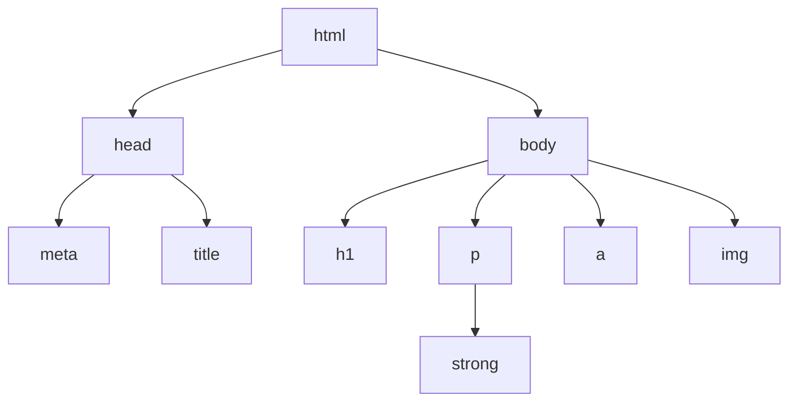

# 属性值的计算过程
- 能够从更高的角度看网页的渲染过程

浏览器的渲染是逐个进行渲染的，渲染顺序是按照文档的书写顺序进行的，渲染的顺序是按照`DOM`树的结构顺序进行的。

**网页渲染每个元素的前提条件：** 该元素的**所有的CSS属性**必须有值，并且该元素的CSS属性值必须能够计算出来，这个计算过程叫做**属性值计算过程**。

## 属性值计算步骤

1. **确定声明值：** 参考样式表中<u>没有冲突的声明</u>作为CSS属性值。
2. **层叠冲突:** 对样式表中<u>有冲突的声明</u>，使用层叠规则确定CSS属性。
3. **使用继承:** <u>对仍然没有值的属性</u>，若可以继承，则使用父元素的值。
4. **使用默认值:** 对仍然没有值的属性，使用默认值。

**特殊的两个CSS取值：**
- `inherit`：手动继承父元素的属性。
- `initial`：将该属性设置为默认值。

