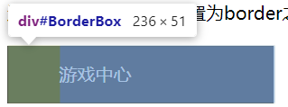
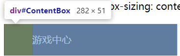

# 盒模型应用

## 改变宽高范围

默认情况下，`width`和`height`属性只作用于内容盒（精确计算），如果需要改变整个区域的宽高范围，可以使用CSS3中的`box-sizing`属性。

**`box-sizeing` 中有两个属性：** 改变宽高的影响范围
   1. `content-box`：默认值，表示只计算内容盒的宽高范围
```css
#ContentBox {
   width: 236px;
   height: 51px;
   color: white;
   background-color: #2d2e36;
   line-height: 51px;
   padding-left: 46px;
}
```


   2. `border-box`：边框盒，表示计算整个盒子的宽高范围
```css
#BorderBox{
   width: 236px;
   height: 51px;
   color: white;
   background-color: hsl(233, 9%, 19%);
   line-height: 51px;
   padding-left: 46px;
   box-sizing: border-box;
}
```


## 改变背景覆盖范围
默认情况下背景覆盖边框盒，可以通过`background-clip`属性来改变。

**`background-clip` 中有三个属性：**
   1. `border-box`：表示只覆盖边框盒
   2. `padding-box`：表示只覆盖内边距盒
   3. `content-box`：表示只覆盖内容盒(默认)

## 溢出处理

## 段词规则

## 空白处理